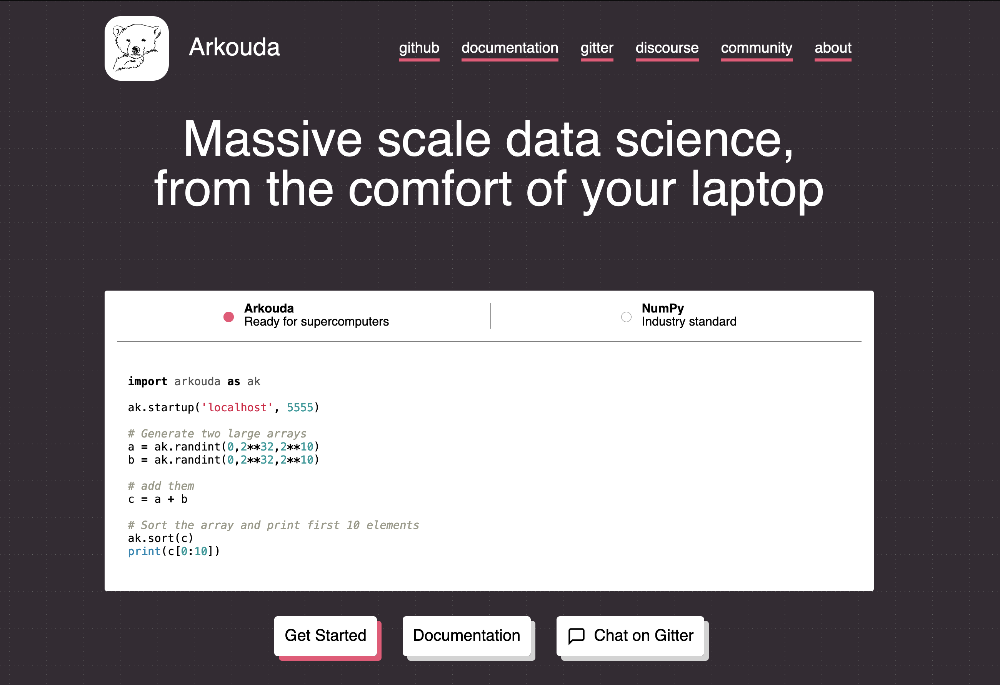

# Arkouda's Website

This repository contains the website for the Arkouda Python library. Follow
the steps below to download the website locally and make changes to the landing
page.

## Getting Started
### Downloading using Git

To clone the website repository, you need to use [Git](https://git-scm.com/).
On macOS, you should probably use [Homebrew](https://brew.sh/) to install it;
otherwise, you can follow the [installation instructions](https://git-scm.com/book/en/v2/Getting-Started-Installing-Git).
If you are having trouble with Git, check out the [visual tutorial](https://learngitbranching.js.org/)
on how certain commands work.

With Git in hand, you can download the repository with the following command:

```bash
# Use Git to download the repository
git clone https://github.com/DanilaFe/arkouda-website.git

# Move to the repository when running subsequent commands
cd arkouda-website
```

After the above commands, you have the files necessary to build the blog.

### Building the Site using Hugo
The blog is written in [Markdown](https://www.markdownguide.org/), while
websites use HTML. This website uses [Hugo](https://gohugo.io/) to convert
human-readable Markdown into HTML. You need to [install Hugo](https://gohugo.io/installation/)
as well. On macOS, you can once again use Homebrew to install Hugo.

Having installed Hugo, you can launch a local preview of the website using
the following command:

```bash
hugo server
```

Then, navigate to `localhost:1313` to preview the website, which should
look like this:



## Editing the Site

Generally, each page on the site has a corresponding Markdown file. For the
landing page (which is currently the only page on the site), this Markdown
file is `content/_index.md`. Thus, to edit things like the quotes, graphs,
and other text on the landing page, you'll want to edit this file.

Another file plays a role in what gets displayed on the screen: `hugo.toml`.
This file is intended for editing things that show up across the entire site.
At this time, since there's only one page, this means `hugo.toml` only
controls aspects of that one page. If more pages were added, changes to `hugo.toml`
will be applied to all of them. Currently, this file controls the navigation
links at the top of the page ("GitHub", "Documentation", etc.).

As a quick guide, here are the files (and sections of these files) that you
should look at.

| I want to edit...                                | Relevant file and section                    | More details |
|--------------------------------------------------|----------------------------------------------|--------------|
| The navigation buttons at the top                | `hugo.toml`                                  | [Editing Hugo.toml](#editing-hugotoml) |
| The big tagline, code blocks, or buttons         | `content/_index.md`, above the `---` divider | [Editing the Front Matter](#editing-the-front-matter) |
| The quotes, quick summary, or the lower sections | `content/_index.md`, below the `---` divider | [Editing the Markdown Content](#editing-the-markdown-content) |

### Editing `hugo.toml`

To edit site-wide items such as the navigation menu at the top of each page,
you should edit `hugo.toml`. This file contains several entries in the
following format:

```
[[menus.main]]
name = 'GitHub'
url = 'https://github.com/bears-r-us/arkouda'
weight = 10

[[menus.main]]
name = 'Documentation'
url = 'https://bears-r-us.github.io/arkouda/'
weight = 20
```

Each `[[menus.main]]` entry with a `name`, `url`, and `weight` corresponds
to a link in the navigation menu. The options are as follows:

* `name`: The human-readable text that should be displayed for the link, such
  as "GitHub", "documentation", etc. You should write these using title
  capitalization, such as "Documentation", "About Us", etc. Hugo will
  automatically format the link text to match the other links' style.
* `url`: The actual web page to which the navigation button should link.
  For instance, the "GitHub" in the sample above links to Arkouda's project
  on GitHub.
* `weight`: a number that represents where the link should occur in the list.
  Links with a lower weight (i.e., "lighter" links) show up earlier in the
  list ("float to the top"), while links with a higher weight (i.e., "heavier" ones)
  show up later ("sink to the bottom"). Thus, the item with the lowest weight
  will be first. To re-order the links, change their weights to reflect
  the order you want them to occur in.

To remove links, simply delete their entry from the list (should be 4 lines).
To modify the links, refer to the descriptions of the properties above. To
add new links, add a new 4-line entry with the desired name, URL, and weight.

### Editing the Front Matter

_Note:_ This section and the next explain how to modify the `content/_index.md`
file; modifying this file only affects the landing page._

Hugo pages are written using Markdown. However, they can also carry some
meta-data that describes the page. This metadata includes the title of the
page, the data of publication, and more. This is called the _front matter_.
For the Arkouda website in particular, we provide additional information to
describe the things on the page, most significantly:

* The tagline ("Massive scala data science...").
* The code blocks comparing Arkouda to other libraries
* The buttons, such as "Get Started"
* Announcements, if any

These things are encoded in the front matter because they have a more
complicated structure. For instance, the code blocks have a "click-to-view-code"
behavior, which is hard to write in Markdown, especially for editors who
aren't familiar with HTML.

The front matter is actually in [YAML](https://en.wikipedia.org/wiki/YAML) format.
The important pieces of the syntax are the _key-value pairs_ and _lists_.
A key-value pair is written on a line, separated by a column:

```YAML
title: The title of the page
```

In the above, `title` is the key, and "The title of page" is the value.
The `tagline` key in `content/_index.md` contains the text of the big sentence
at the very top of the page. The code snippets, buttons, and the announcement,
all are written using keys: `codes`, `buttons`, and `announcement`. Most
of these keys, however, contain lists. Lists are written using dashes:

```YAML
buttons:
    - name: "Get Started"
      primary: true
      url: "#"
    - name: "Documentation"
      url: "#"
    - name: "Chat on Gitter"
      icon: "message-square"
      url: "#"
```

Above, the `buttons` key contains a list of thee items; each item has
its own keys: `name`, `primary`, `url`, and `icon`. Not all of the keys are
required; `primary` is only present in the first button, and `icon` in the last.

To add a new item to the list, you can use a dash and write the appropriate
keys matching the above format. The following sections detail the format
of the `codes`, `buttons`, and `announcement` bits of the front matter.

#### The `codes` section
This section contains the program samples that should be compared against Arkouda
in the big introductory code box. The first item should be Arkouda itself;
other technologies, such as NumPy and Dask can be added as additional
entries. Each entry consists of several pieces:

```YAML
  -
    name: "Arkouda"
    title: "Ready for supercomputers"
    code: |
      import arkouda as ak

      ...
```

The keys are as follows:

* `name`: this is the bolded title of the technology that's
being used in the code block.
* `title`: the non-bolded portion that (briefly) clarifies what the option is,
  and what distinguishes it from the other. At the time of writing, Arkouda's
  title is "Ready for supercomputers", to indicate its usability in highly
  distributed environments, and NumPy's title is "Industry standard", to
  highlight its ubiquity.
* `code`: this contains the actual (Python) code to show off. Note that to
  support a properly-formatted multi-line code block, the key starts with a
  vertical bar: `code: |`. The subsequent lines are indented past the `code:`.

Together, the `name` and `title` make up the clickable button at the top of
the code block that allows a user to select a sample. To add a new code block
to the menu, add a new entry with the above three keys.

#### The `buttons` section

This section contains the clickable buttons below the code block. This
is represented as a list:

```YAML
buttons:
    - name: "Get Started"
      primary: true
      url: "#"
    - name: "Documentation"
      url: "#"
    - name: "Chat on Gitter"
      icon: "message-square"
      url: "#"
```

There are four keys that can be used to control the buttons' appearance:

* `name` **(Required)**: The text of the link, such as "Documentation".
* `url` **(Required)**: The URL/link that the button goes to.
* `primary`: whether the link is a 'primary' link. Primary linked are displayed
  using color (as opposed to plain white / greyish).
* `icon`: the link that the button should have. Consult the [Feather Icons](https://feathericons.com/)
  list for available icons.

Links are displayed in the order that they're listed. To add a new link,
add a new list entry with the `name` and `url` keys, and, optionally, the `primary`
and `icon` keys.

#### The `announcement` section

Currently, there's only support for one announcement at a time, presumably
the latest / most important one. Announcements only have two keys:

* `title`: The title of the announcement (displayed in bold). This is something
  like "Version X released", or "ArkoudaCon 2045".
* `content`: The text of the announcement which contains details. Much like the
  code in the `codes` section, this is written on multiple lines using the
  vertical bar, `content: |`. The text is written in Markdown, and automatically
  rendered by Hugo.

### Editing the Markdown Content

After the code block, buttons, and announcement sections, the rest of the
site is written using Markdown, with a handful of Hugo-specific extensions.

#### Intro to Shortcodes

The most important extension are _shortcodes_. These Hugo-specific textual
commands that can be used to create "fancier" content. For instance,
native Markdown has support for text decoration (italics, bold, links),
tables, code blocks, and lists. However, it doesn't have a way to represent
structures like "graph", "block with a border that calls out an Arkouda
feature", or "quote with attribution and link".

To bridge the gap between what needs to be displayed on the website -- which
includes all the things in the previous paragraph -- and what can be written
in Markdown, Hugo introduces shortcodes. For instance, here's an example
of how quotes are written in the `content/_index.md` file:

```

Arkouda is my favorite breakfast meal! It's very filling and nutritious.

```

A shortcode has the following pieces:

* The opening and closing tags: that's the `` and ``.
  Text between the opening and closing tags is considered a part of the
  "content" of the shortcode, and is treated according to what the shortcode
  is for.

  Shortcodes that have content need to have both an opening and a closing tag.
  Notice that the closing tag starts with a `/`.
* The name of the shortcode (that's `quote` in the above example). The name
  determines what sort of thing you're trying to create. The name in the
  opening and closing tags should match (i.e., `quote` and `/quote`, not
  `quote` and `/somethingelse`).
* The arguments to the shortcode: that's `author="Daniel Fedorin"` etc. These
  are used to provide additional information that's not strictly part
  of the content (e.g., the "content" of a quote is the text being quoted,
  while the additional information is "who said this" and "what organization
  are they a part of").
* The content of the shortcode: that's "Arkouda is my favorite...". This content
  is regular old Markdown, though it can contain other shortcodes
  (see [Nesting shortcodes](#nesting-shortcodes)).

#### Available Shortcodes

The following shortcodes are provided by the blog:

| Name | Purpose | Parameters |
|------|---------|------------|
| `quote` | Writing a quote from a user. | `author`: the person who said the quote. <br> `affiliation`: the company or organization the author is associated with.<br>`url`: the link to the affiliated organization (e.g., HPE's website if HPE)<br> content should be the text of the quote. |
| `rect` | A small rectangle with text and a border. | content should be the text in the block. |
| `rectlist` | Contents should be a several `rect`s to display side-by-side. | content should be `rect`s |
| `block` | A rectangle of text that is as wide as the screen, and has a border. | content should be the text in the block. |
| `graph` | Currently, very hardcoded graph of Arkouda performance. Does not need a closing tag. | none |
| `diff`  | A code block highlighted as a 'diff' (deleted and added lines). | Content should be code. The first character of each line should be one of thee things:<br>an empty space: indicates the line is unchanged.<br>`+`: indictes a line was added.<br>`-`: indicates a line was removed.<br><br>The lines are automatically colored red and green if they are removed/added. |

#### Nesting Shortcodes

Shortcodes can be nested. For instance, the intention of the `rect` shortcode
is to place several `rect`s inside a single `rectlist` shortcode. By doing so,
all of the "rectangles" are put on the same line, matching the expected
visual styling of the site. To place one shortcode inside another, just
write it between the opening and closing tags:

```


I am a rect that's inside a rectlist


I am another rect that's inside a rectlist


```

#### Editing Sections

Reach major section on the site starts with a `## ` -- its title. This is standard
Markdown for "second level heading" (lower level means bigger heading). The
tagline is currently the biggest heading ("first level").

To edit the title of the section, simply edit the text that follows the
`## `. To reorder sections, move the title and the lines below it (up to
the next `## `) into a different location. E.g., suppose you have the
following:

```Markdown
## Section A

Contents of section A...

{{< rect }}
Maybe even a rect!


## Section B

Contents of section B...
```

To move Section A below Section B:

```Markdown
## Section B

Contents of section B...

## Section A

Contents of section A...

{{< rect }}
Maybe even a rect!

```

Within some sections (currently, "With Arkouda, you can..."), blocks
are used to visually distinguish parts of the page from each other. This
is done using the `block` shortcode.

Otherwise, you can generally edit a piece of text by finding that
piece of text in the `_index.md` file, and modifying it as desired.
